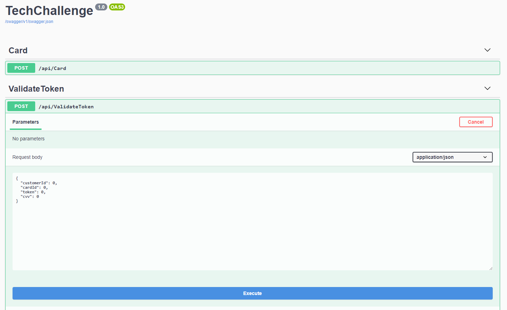

# TechChallenge

A project to show basic skills with [dotnet core](https://dotnet.microsoft.com/) to generate token for cashless registration.

## Installation

If you area using Visul Studio, all dependencies will be installed automatically.

If using dotnet CLI, use:

```bash
dotnet restore
```

#### List of dependencies:

- [Entity framework core](https://www.nuget.org/packages/Microsoft.EntityFrameworkCore/)
- [Swashbuckle](https://www.nuget.org/packages/Swashbuckle.AspNetCore/)
- [xUnit](https://www.nuget.org/packages/xunit/)
- [Moq](https://www.nuget.org/packages/Moq/)
- [MockQueryable.Moq](https://www.nuget.org/packages/MockQueryable.Moq/)

## Usage

The project uses only WebApi, without view, but its comes with Swashbuckler/Swagger (For now its only show when in Development ambient) to display all API and provide means to test them. See below a screen shoot.



## APIs

There's two API for this project, each one with their one details

### Generate Token

```
/api/Card
```

This one will save a card number e a CVV, and based on these,  generate a token using a rotation algorithm.

##### Description of Algorithm

For each array, perform a number of right circular rotations and return this array.
For example, array a = [3, 4, 5], number of rotations k = 2.
First we perform the two rotations:
[3, 4, 5] -> [5, 3, 4] -> [4, 5, 3]

##### Implementation

A Obvious implementation could be using a **loop** (for, while).

But the problem uses a valor for *k* up to 5 digits and an array with 4 number, maybe a loop couldn't fit. Was noted that the order never change, only when you start to look, like a *pointer* to "start here". so, instead of manage the numbers, I could manage this point. The algorithm then became:

1. Calculate the pointer position
2. Divide the array in two halves
3. Put the last half at the begin

*p.s:* This reminder me later of [fast inverse square root](https://en.wikipedia.org/wiki/Fast_inverse_square_root), and I know it's not the same.

### Validate Token

```
/api/ValidateToken
```

This endpoint will match information the the database with information form the API.

A token will be valid if all the conditions below are true:
- Creation date less then 30 minutos ago
- There is a cardId in the database
- This card belongs to the customer
- The token receive matches with do token that will be calculate from the database

Otherwise, the token will be invalid